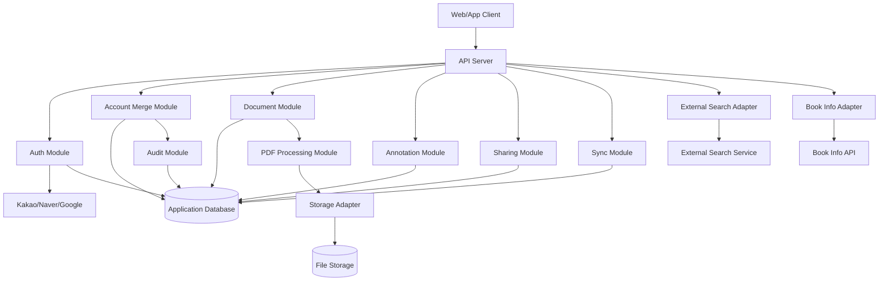
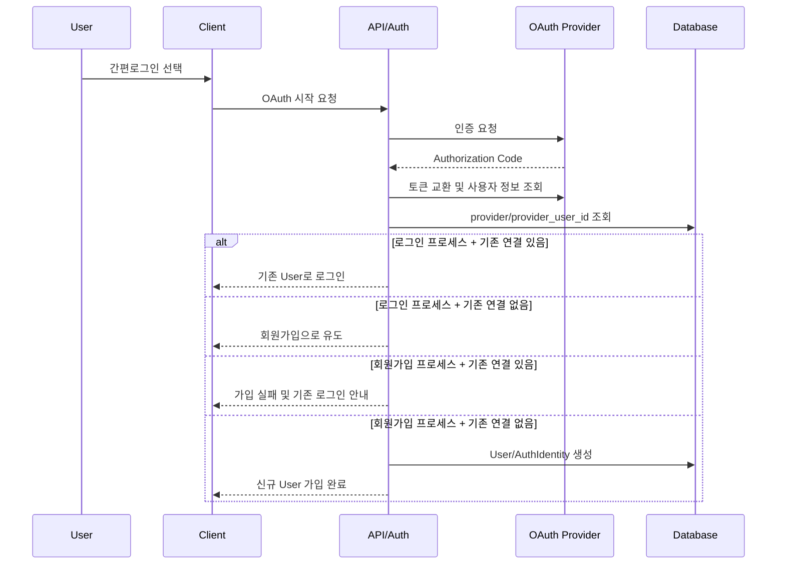
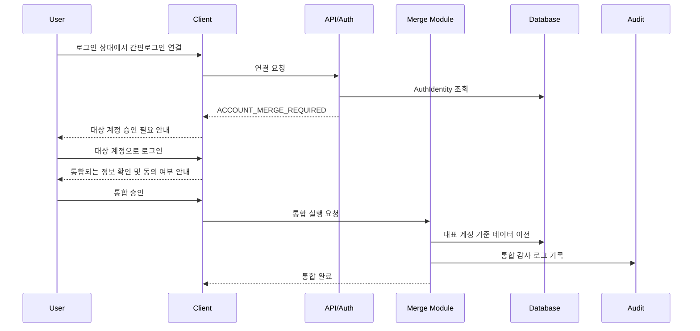
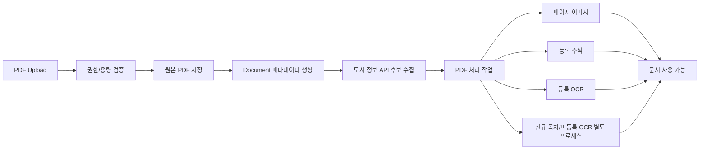

# 아키텍처 문서

## 1. 목적

PDFowers의 상위 아키텍처 방향, 시스템 경계, 주요 모듈 간 관계, 확정/검토 필요 결정을 정리한다. 본 문서는 구현 착수 전 전체 구조를 공유하기 위한 기준 문서다.

## 2. 아키텍처 원칙

- 내부 회원 식별자(`user_srno`)는 사용자가 입력하는 로그인 ID와 외부 로그인 제공자 식별자와 분리한다.
- 도메인은 User, Document, Version, Annotation, Sharing, Sync, Storage, Audit로 나눈다.
- PDF 원본과 편집 데이터는 분리 저장하고, 내보내기 시 병합한다.
- 스토리지와 외부 검색은 어댑터 경계 뒤에 둔다.
- 계정 통합과 주요 데이터 이전은 트랜잭션과 감사 로그를 필수로 한다.
- 미확정 인프라 항목은 단정하지 않고 ADR로 결정한다.

## 3. 논리 아키텍처

## 4. 주요 모듈

| ID | 모듈 | 역할 | 주요 의존성 |
| :--- | :--- | :--- | :--- |
| `000304_001` | Client | 사용자 화면, PDF 뷰어, 주석/목차/통합 UX | API Server |
| `000304_002` | API Server | 도메인 API와 인증/권한 게이트 | DB, Storage Adapter |
| `000304_003` | Auth Module | ID/이메일 계정, OAuth/OIDC, 세션, 로그인 수단 연결 | OAuth Providers, DB |
| `000304_004` | Account Merge Module | 통합 후보 확인, 동의 처리, 데이터 이전 | DB, Audit Module |
| `000304_005` | Document Module | 문서 생명주기와 메타데이터 | DB, PDF Processing |
| `000304_006` | PDF Processing Module | 원본 분해, OCR, 병합 PDF 생성 | Storage Adapter |
| `000304_007` | Storage Adapter | 파일 저장소 추상화 | NAS/Ubuntu 후보 |
| `000304_008` | Audit Module | 감사 이벤트 기록 | DB |
| `000304_009` | External Search Adapter | 키워드 기반 외부 검색 연동 | 외부 검색 서비스 |
| `000304_010` | Book Info Adapter | 도서 정보 API를 통한 문서 메타데이터 후보 수집 | 외부 도서 정보 API |

## 5. 데이터 흐름

### 5.1 인증 흐름

### 5.2 계정 통합 흐름

### 5.3 PDF 업로드/처리 흐름

## 6. 배포 및 운영 관점

| ID | 항목 | 현재 방향 |
| :--- | :--- | :--- |
| `000306_001` | 운영 배포 | Cloudtype을 운영 배포 서비스로 사용 |
| `000306_002` | 테스트/검증 배포 | NAS Docker를 테스트/검증 배포 환경으로 사용 |
| `000306_003` | 스토리지 | NAS는 이미지 저장소, 원격지 Ubuntu는 PDF 문서 저장소로 사용 |
| `000306_004` | 시크릿 | Cloudtype 환경변수/시크릿, GitHub Secrets, 로컬 `.env.local` |
| `000306_005` | 결정 관리 | 운영 조합 확정 시 ADR 작성 |

## 7. 보안 아키텍처

- Client Secret은 서버 모듈에서만 사용한다.
- 클라이언트에는 OAuth Client Secret, DB 접속 정보, 세션 서명 키를 노출하지 않는다.
- 환경별 OAuth 앱과 DB 계정을 분리한다.
- 민감정보는 문서와 로그에 원문으로 남기지 않는다.
- AI 검색 연동은 사용자가 명시한 키워드만 외부로 전달한다.

## 8. 아키텍처 결정 현황

| ID | 결정 | 상태 | 근거 |
| :--- | :--- | :--- | :--- |
| `000308_001` | 내부 회원은 `user_srno` 기준, 사용자 입력 ID는 `login_id` 기준 | 승인 | [ADR-003 결정](../../06_의사결정관리/ADR-003_인증방식선택.md#결정) |
| `000308_002` | 본인인증 MVP 제외 | 승인 | [ADR-003 결정](../../06_의사결정관리/ADR-003_인증방식선택.md#결정) |
| `000308_003` | 카카오/네이버/구글 간편로그인 후보 | 승인 | [ADR-003 결정](../../06_의사결정관리/ADR-003_인증방식선택.md#결정) |
| `000308_004` | 이메일 동일성 자동 통합 금지 | 승인 | [시스템 정책 - 이메일 자동 통합 금지](../../01_정책관리/01_시스템정책.md#policy-auth-004-이메일-자동-통합-금지) |
| `000308_005` | 계정 통합은 사용자 동의 기반 | 승인 | [시스템 정책 - 계정 통합](../../01_정책관리/01_시스템정책.md#policy-auth-006-계정-통합), [ADR-003 계정 통합 결정](../../06_의사결정관리/ADR-003_인증방식선택.md#계정-통합-결정) |
| `000308_006` | NAS/Ubuntu 스토리지 역할 | 승인 | NAS는 이미지, 원격지 Ubuntu는 PDF 문서 저장소로 사용 |
| `000308_007` | Cloudtype/NAS Docker 운영 분담 | 승인 | Cloudtype은 운영 배포, NAS Docker는 테스트/검증 배포 |
| `000308_008` | AI 검색 MVP 포함 여부 | 보류 | 후순위 기능이며 단순 링크 연동을 우선 예상 |

## 9. 후속 상세 문서 연결

- 데이터베이스 설계서: User, AuthIdentity, Document, Annotation, Sharing, Audit 상세 스키마 확정
- API 명세서: 인증, 계정 통합, 문서, 주석, 공유, 동기화 API 정의
- UI/UX 디자인 문서: 계정 통합 안내, PDF 뷰어, 주석, 공유 화면 정의
- 테스트 계획서: 인증/계정 통합, PDF 처리, 보안 정책 검증 케이스 정의
- 배포 및 운영 가이드: Cloudtype/NAS Docker/스토리지/시크릿 운영 절차 확정

## 10. 관련 문서

- [요구사항 명세서 - 전체 구현 대상](./01_요구사항명세서.md#3-전체-구현-대상)
- [시스템 설계서 - 시스템 구성요소](./02_시스템설계서.md#3-시스템-구성요소)
- [ADR-003 인증 방식 선택 - 결정](../../06_의사결정관리/ADR-003_인증방식선택.md#결정)
- [논리모순 검토 대장 - 검토 항목](../../08_이슈관리/논리모순_검토대장.md#검토-항목)

## 작업 이력

| 작업일시 | 작업 에이전트 | 작성자 | 내용 한 줄 요약 |
| :--- | :--- | :--- | :--- |
| 2026-06-08 02:20 KST | Codex | jkoogi | 문서 작업 이력 섹션 추가 |
| 2026-06-08 22:45 KST | Codex | jkoogi | PR 리뷰 기반 인증 분기와 PDF 처리 흐름 보완 |
