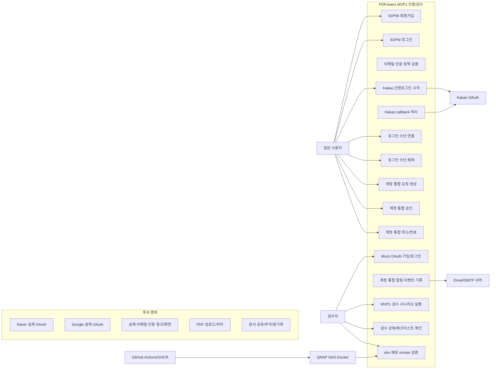

# 01. MVP1 유스케이스 다이어그램

## 1. 범위

본 문서는 2026-06-17 기준 구현된 MVP1 인증/검수 기능을 대상으로 한다. PDF 업로드, PDF 처리, 주석, 공유, 동기화는 전체 제품 요구사항에는 포함되지만 MVP1 구현 대상이 아니므로 본 다이어그램에서는 후속 범위로만 표시한다.

## 2. 액터

| 액터 | 설명 |
| :--- | :--- |
| 일반 사용자 | ID/PW, OAuth, 계정 통합 대상이 되는 서비스 사용자 |
| 검수자 | MVP1 검수화면에서 API/시나리오/상태를 확인하는 내부 사용자 |
| Kakao OAuth | 실제 Kakao OAuth authorize/token/profile 제공자 |
| Email/SMTP 서버 | 계정 통합 요청/승인 알림 발송 대상 |
| GitHub Actions/GHCR | dev 이미지 빌드 및 이미지 저장소 |
| QNAP NAS Docker | dev 검수 서버 실행 환경 |

## 3. 유스케이스 다이어그램

## 4. 유스케이스 목록

| ID | 유스케이스 | 주 액터 | 구현 상태 | 구현 근거 |
| :--- | :--- | :--- | :---: | :--- |
| `MVP1-UC-001` | ID/PW 회원가입 | 일반 사용자, 검수자 | 구현 | `POST /auth/signup/local`, `createLocalUser` |
| `MVP1-UC-002` | ID/PW 로그인 | 일반 사용자, 검수자 | 구현 | `POST /auth/login/local`, `verifyLocalLogin` |
| `MVP1-UC-003` | 이메일 인증 정책 검증 | 검수자 | 부분 구현 | 이메일 인증 필수/선택 도메인 로직, 실제 인증 메일 링크는 후속 |
| `MVP1-UC-004` | Kakao 간편로그인 시작 | 일반 사용자 | 구현 | `GET /auth/kakao/start`, `KakaoOAuthClient.buildAuthorizeUrl` |
| `MVP1-UC-005` | Kakao callback 처리 | 일반 사용자 | 구현 | `GET /auth/kakao/callback`, token/profile 조회, 검수화면 redirect |
| `MVP1-UC-006` | Mock OAuth 가입/로그인 | 검수자 | 구현 | `POST /auth/oauth/:provider/callback` |
| `MVP1-UC-007` | 로그인 수단 연결 | 일반 사용자, 검수자 | 구현 | `POST /auth/identities/:provider`, `linkOAuthIdentity` |
| `MVP1-UC-008` | 로그인 수단 해제 | 일반 사용자, 검수자 | 구현 | `DELETE /auth/identities/:provider`, `unlinkOAuthIdentity` |
| `MVP1-UC-009` | 다른 계정 provider 연결 시 통합 요청 생성 | 일반 사용자 | 구현 | `ACCOUNT_MERGE_REQUIRED`, `account_merge_request` |
| `MVP1-UC-010` | 계정 통합 승인 | 일반 사용자, 검수자 | 구현 | `POST /auth/merge-requests/:id/approve`, `approveMergeRequest` |
| `MVP1-UC-011` | 계정 통합 취소/만료 | 검수자 | 구현 | `cancelMergeRequest`, 만료 승인 방어 |
| `MVP1-UC-012` | 계정 통합 알림 이벤트 기록 | 시스템 | 부분 구현 | sample/SMTP 이벤트 생성, 실제 수신 검증 후속 |
| `MVP1-UC-013` | MVP1 검수 시나리오 실행 | 검수자 | 구현 | `POST /api/review/scenarios/:scenarioId` |
| `MVP1-UC-014` | MVP1 검수 상태 확인 | 검수자 | 구현 | `GET /api/review/state`, 정적 검수화면 |
| `MVP1-UC-015` | dev 배포 smoke 검증 | 검수자, QNAP | 부분 검증 | `/auth/kakao/config-status`, `/auth/kakao/start` |

## 5. 유스케이스 관계

| 관계 | 설명 |
| :--- | :--- |
| Kakao 간편로그인 시작 → Kakao callback 처리 | `state` cookie와 OAuth state map으로 callback 검증 |
| 로그인 수단 연결 → 계정 통합 요청 생성 | 연결하려는 provider identity가 다른 사용자에게 있으면 자동 연결하지 않음 |
| 계정 통합 승인 → 계정 상태 변경 | 대상 계정의 identity를 요청 계정으로 이전하고 대상 계정을 `merged` 처리 |
| 계정 통합 요청/승인 → 알림 이벤트 | 대상/요청 계정에 sample 또는 SMTP 알림 이벤트 생성 |
| 검수 시나리오 실행 → 검수 상태 확인 | 검수화면은 시나리오 실행 결과와 `MVP1-AUTH-T001~T020` 상태를 표시 |
