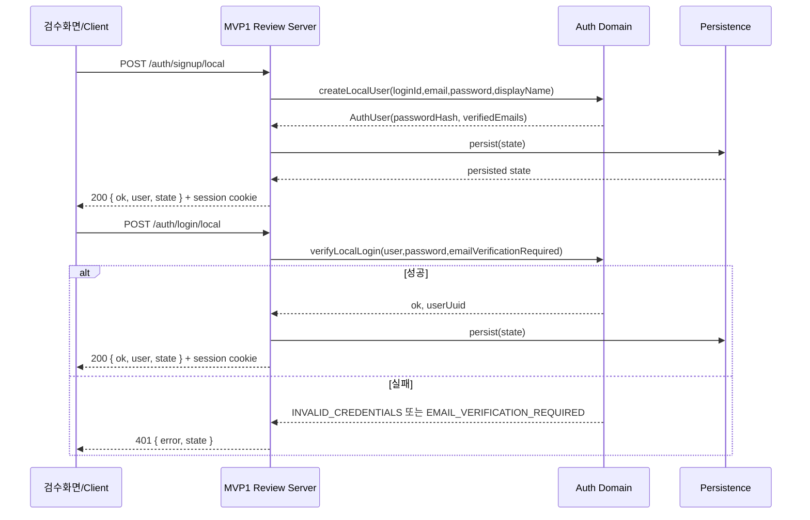
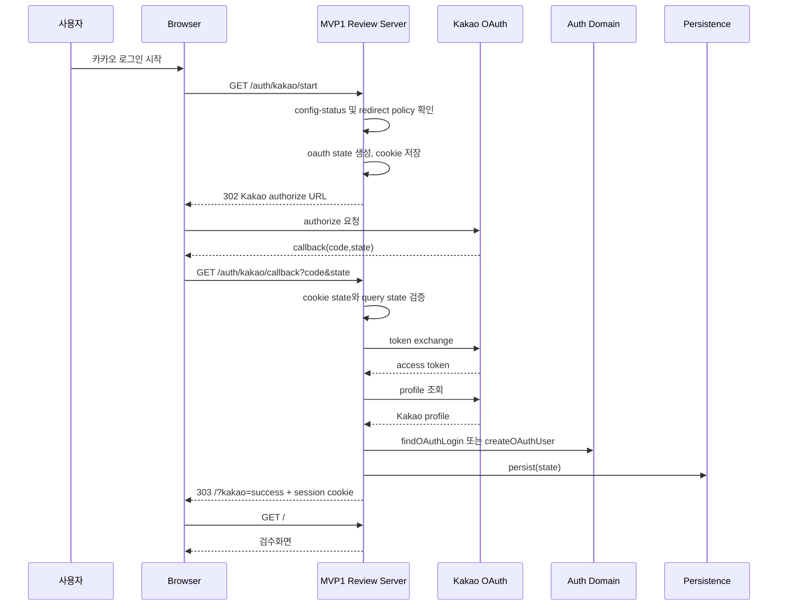
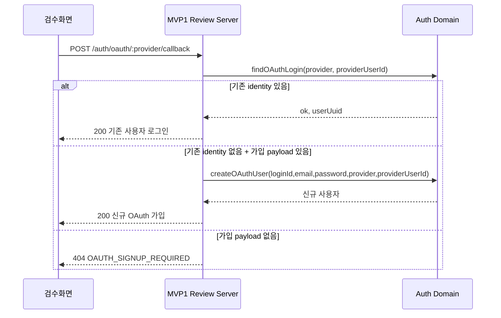
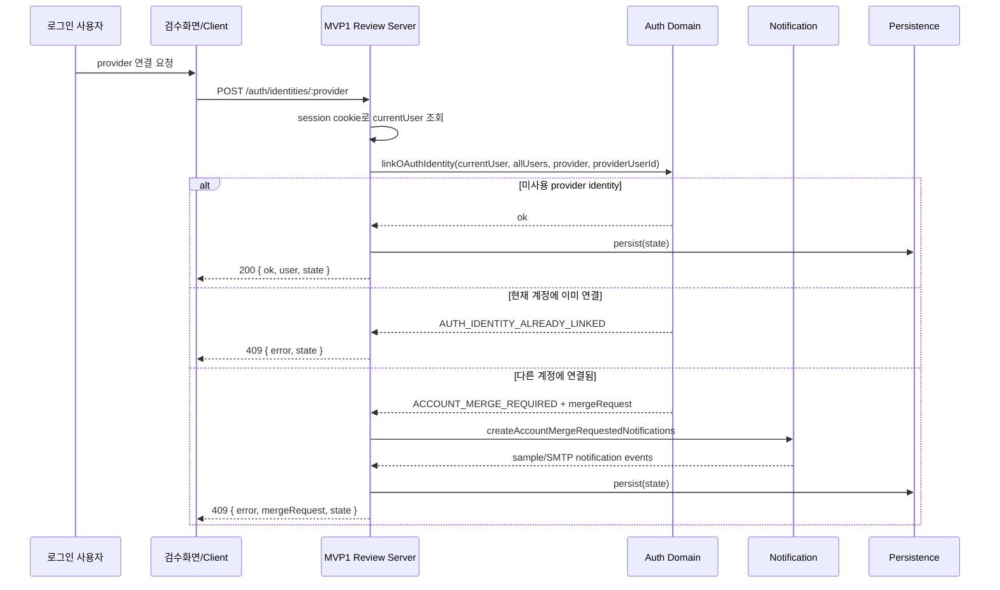
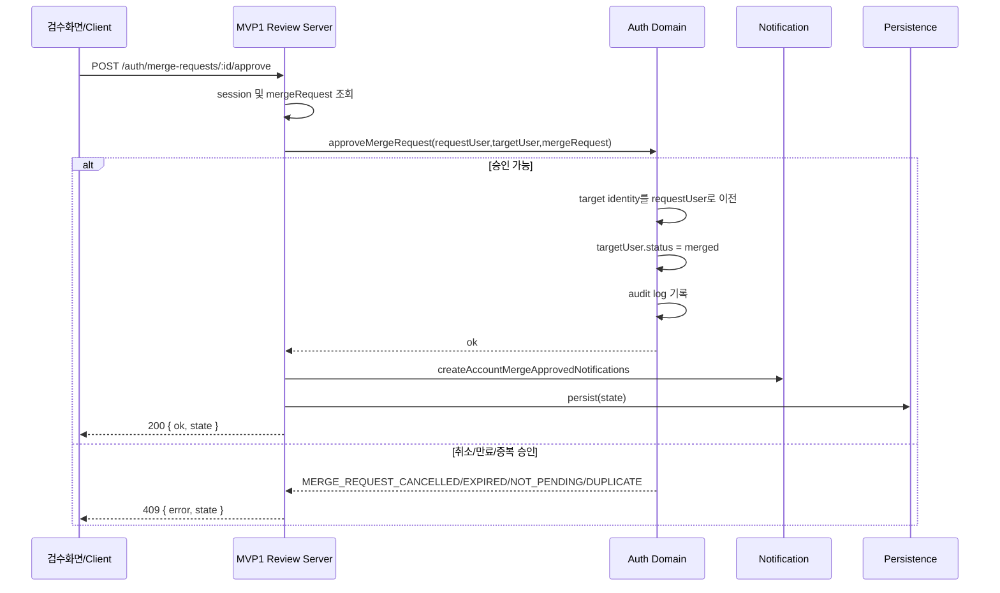
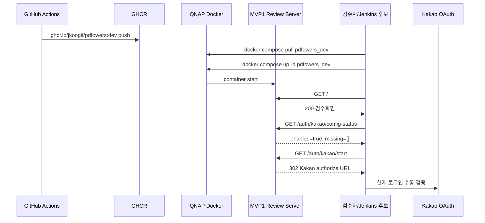

# 02. MVP1 시퀀스 다이어그램

## 1. ID/PW 회원가입 및 로그인

## 2. Kakao 실제 OAuth 로그인

## 3. Mock OAuth 가입/로그인

## 4. 로그인 수단 연결 및 계정 통합 요청

## 5. 계정 통합 승인

## 6. dev NAS 배포 검증

## 7. 예외 흐름

| 흐름 | 예외 | 처리 |
| :--- | :--- | :--- |
| Kakao callback | code 없음 | `/?kakao_error=KAKAO_OAUTH_CODE_REQUIRED`로 복귀 |
| Kakao callback | state mismatch | `/?kakao_error=KAKAO_OAUTH_STATE_MISMATCH`로 복귀 |
| Kakao callback | token/profile 실패 | `/?kakao_error=KAKAO_OAUTH_CALLBACK_FAILED`로 복귀 |
| 계정 연결 | 인증 세션 없음 | `AUTHENTICATION_REQUIRED` |
| 계정 통합 승인 | 요청 없음 | `MERGE_REQUEST_NOT_FOUND` |
| 계정 통합 승인 | 만료 | `MERGE_REQUEST_EXPIRED`, 상태 `expired` |
| 배포 smoke | Node 인증서 체인 신뢰 실패 | `UNABLE_TO_GET_ISSUER_CERT_LOCALLY`, NAS 인증서 체인 후속 점검 |
