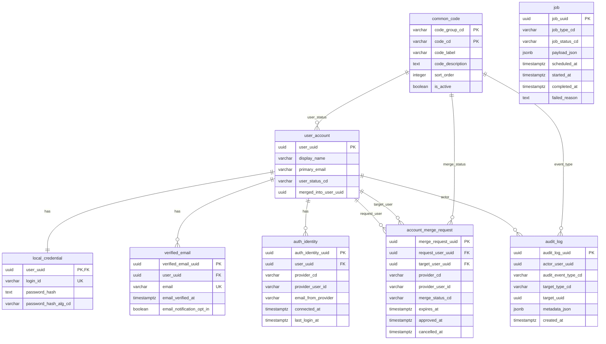
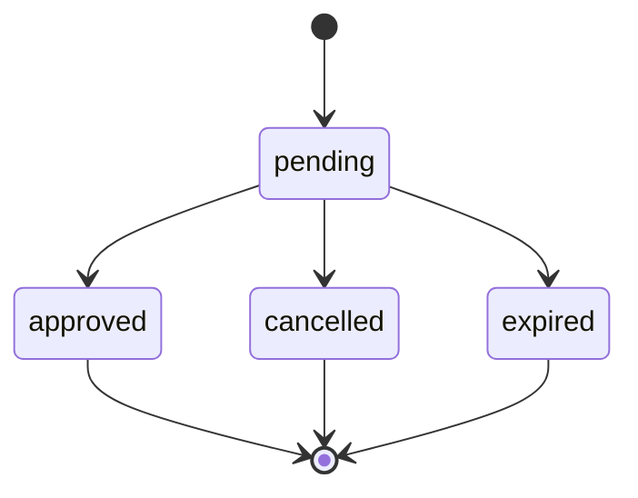

# 04. MVP1 테이블 정의서

## 1. 범위

본 문서는 `src/db/schema/auth.ts`와 Drizzle migration을 기준으로 MVP1 인증/검수 구현에 사용되는 PostgreSQL 테이블을 정의한다.

## 2. 공통 메타 컬럼

다음 컬럼은 `audit_log`를 제외한 주요 업무 테이블에 공통 적용된다.

| 컬럼 | 타입 | 필수 | 기본값 | 설명 |
| :--- | :--- | :---: | :--- | :--- |
| `created_sys` | varchar(50) | Y | `pdfowers` | 생성 시스템 |
| `created_at` | timestamptz | Y | `now()` | 생성 시각 |
| `created_by` | varchar(100) | Y | `system` | 생성자 |
| `updated_sys` | varchar(50) | Y | `pdfowers` | 수정 시스템 |
| `updated_at` | timestamptz | Y | `now()` | 수정 시각 |
| `updated_by` | varchar(100) | Y | `system` | 수정자 |
| `version` | integer | Y | `1` | 낙관적 잠금/버전 후보 |

## 3. ERD

## 4. `common_code`

| 컬럼 | 타입 | 키 | 필수 | 설명 |
| :--- | :--- | :---: | :---: | :--- |
| `code_group_cd` | varchar(100) | PK | Y | 코드 그룹 |
| `code_cd` | varchar(100) | PK | Y | 코드 |
| `code_label` | varchar(100) |  | Y | 표시명 |
| `code_description` | text |  | N | 설명 |
| `sort_order` | integer |  | Y | 정렬 순서 |
| `is_active` | boolean |  | Y | 활성 여부 |

주요 코드 그룹:

| 그룹 | 코드 예시 | 용도 |
| :--- | :--- | :--- |
| `USER_STATUS` | `active`, `merged` | 사용자 상태 |
| `MERGE_STATUS` | `pending`, `approved`, `cancelled`, `expired` | 계정 통합 요청 상태 |
| `AUDIT_EVENT_TYPE` | `LOGIN_SUCCESS`, `ACCOUNT_MERGE_APPROVED` 등 | 감사 이벤트 |
| `JOB_STATUS` | 후보 | 비동기 job 상태 |

## 5. `user_account`

| 컬럼 | 타입 | 키 | 필수 | 설명 |
| :--- | :--- | :---: | :---: | :--- |
| `user_uuid` | uuid | PK | Y | 내부 사용자 식별자 |
| `display_name` | varchar(100) |  | Y | 표시명 |
| `primary_email` | varchar(320) |  | Y | 대표 이메일 |
| `user_status_cd` | varchar(50) |  | Y | 사용자 상태. `active`, `merged` |
| `merged_into_user_uuid` | uuid |  | N | 통합된 경우 대표 계정 UUID |

## 6. `local_credential`

| 컬럼 | 타입 | 키 | 필수 | 설명 |
| :--- | :--- | :---: | :---: | :--- |
| `user_uuid` | uuid | PK/FK | Y | `user_account.user_uuid` |
| `login_id` | varchar(100) | UK | Y | 사용자 입력 로그인 ID |
| `password_hash` | text |  | Y | scrypt 기반 비밀번호 해시 |
| `password_hash_alg_cd` | varchar(50) |  | Y | 해시 알고리즘 코드 |

제약:

| 제약 | 내용 |
| :--- | :--- |
| `local_credential_login_id_uidx` | `login_id` 유니크 |

## 7. `verified_email`

| 컬럼 | 타입 | 키 | 필수 | 설명 |
| :--- | :--- | :---: | :---: | :--- |
| `verified_email_uuid` | uuid | PK | Y | 인증 이메일 식별자 |
| `user_uuid` | uuid | FK | Y | 사용자 UUID |
| `email` | varchar(320) | UK | Y | 이메일 주소 |
| `email_verified_at` | timestamptz |  | N | 인증 완료 시각 |
| `email_notification_opt_in` | boolean |  | Y | 이메일 알림 수신 동의 |

제약:

| 제약 | 내용 |
| :--- | :--- |
| `verified_email_email_uidx` | 이메일 전역 유니크 |

## 8. `auth_identity`

| 컬럼 | 타입 | 키 | 필수 | 설명 |
| :--- | :--- | :---: | :---: | :--- |
| `auth_identity_uuid` | uuid | PK | Y | provider identity 식별자 |
| `user_uuid` | uuid | FK | Y | 연결 사용자 UUID |
| `provider_cd` | varchar(50) | UK 구성 | Y | `kakao`, `naver`, `google` |
| `provider_user_id` | varchar(255) | UK 구성 | Y | provider 사용자 식별자 |
| `email_from_provider` | varchar(320) |  | N | provider에서 받은 이메일 |
| `connected_at` | timestamptz |  | Y | 연결 시각 |
| `last_login_at` | timestamptz |  | N | 마지막 OAuth 로그인 시각 |

제약:

| 제약 | 내용 |
| :--- | :--- |
| `auth_identity_provider_user_uidx` | `(provider_cd, provider_user_id)` 유니크 |

## 9. `account_merge_request`

| 컬럼 | 타입 | 키 | 필수 | 설명 |
| :--- | :--- | :---: | :---: | :--- |
| `merge_request_uuid` | uuid | PK | Y | 통합 요청 식별자 |
| `request_user_uuid` | uuid | FK | Y | 통합 요청 계정 |
| `target_user_uuid` | uuid | FK | Y | provider identity를 보유한 대상 계정 |
| `provider_cd` | varchar(50) |  | Y | 통합 대상 provider |
| `provider_user_id` | varchar(255) |  | Y | 통합 대상 provider 사용자 식별자 |
| `merge_status_cd` | varchar(50) |  | Y | `pending`, `approved`, `cancelled`, `expired` |
| `expires_at` | timestamptz |  | Y | 만료 시각 |
| `approved_at` | timestamptz |  | N | 승인 시각 |
| `cancelled_at` | timestamptz |  | N | 취소 시각 |

상태 전이:

## 10. `audit_log`

| 컬럼 | 타입 | 키 | 필수 | 설명 |
| :--- | :--- | :---: | :---: | :--- |
| `audit_log_uuid` | uuid | PK | Y | 감사 로그 식별자 |
| `actor_user_uuid` | uuid |  | N | 행위자 사용자 UUID |
| `audit_event_type_cd` | varchar(100) |  | Y | 감사 이벤트 코드 |
| `target_type_cd` | varchar(50) |  | N | 대상 유형 |
| `target_uuid` | uuid |  | N | 대상 식별자 |
| `metadata_json` | jsonb |  | N | 부가 메타데이터 |
| `created_at` | timestamptz |  | Y | 발생 시각 |

주요 이벤트:

| 이벤트 | 설명 |
| :--- | :--- |
| `LOCAL_USER_CREATED` | 로컬 사용자 생성 |
| `AUTH_IDENTITY_LINKED` | OAuth identity 연결 |
| `AUTH_IDENTITY_UNLINKED` | OAuth identity 해제 |
| `LOGIN_SUCCESS` | 로그인 성공 |
| `LOGIN_FAILURE` | 로그인 실패 |
| `EMAIL_VERIFICATION_REQUIRED` | 이메일 인증 필요 |
| `ACCOUNT_MERGE_REQUESTED` | 계정 통합 요청 |
| `ACCOUNT_MERGE_APPROVED` | 계정 통합 승인 |
| `ACCOUNT_MERGE_CANCELLED` | 계정 통합 취소 |
| `ACCOUNT_MERGE_EXPIRED` | 계정 통합 만료 |
| `ACCOUNT_MERGED` | 대상 계정 통합 완료 |
| `EMAIL_CHANGE_REQUESTED` | 이메일 변경 요청 |
| `EMAIL_CHANGED` | 이메일 변경 완료 |

## 11. `job`

| 컬럼 | 타입 | 키 | 필수 | 설명 |
| :--- | :--- | :---: | :---: | :--- |
| `job_uuid` | uuid | PK | Y | job 식별자 |
| `job_type_cd` | varchar(100) |  | Y | job 유형 |
| `job_status_cd` | varchar(50) |  | Y | job 상태 |
| `payload_json` | jsonb |  | Y | 실행 payload |
| `scheduled_at` | timestamptz |  | Y | 실행 예정 시각 |
| `started_at` | timestamptz |  | N | 시작 시각 |
| `completed_at` | timestamptz |  | N | 완료 시각 |
| `failed_reason` | text |  | N | 실패 사유 |

비고: MVP1 계정 통합 핵심 처리는 동기 트랜잭션 기준이며, `job`은 후속 알림/재시도/대량 이전 후보 구조다.
